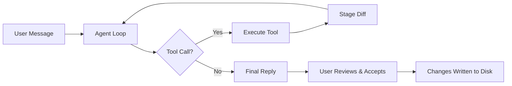

# Personal AI IDE

[](https://opensource.org/licenses/MIT)
[](https://www.python.org/downloads/)
[](https://nodejs.org/)
[](https://fastapi.tiangolo.com/)
[](https://react.dev/)

**AI-powered Integrated Development Environment** – a full‑stack IDE that brings the power of multiple Large Language Models (Groq, Gemini, Hugging Face) directly into your workspace. Chat with an AI assistant that reads, writes, and modifies files – all changes staged for your review before touching disk.

> *For AI engineers building projects that bridge frontend and backend, this is a live, extensible playground. For those new to the stack, the open‑source models and clear architecture make it a cakewalk.*


---

## 📖 Table of Contents

- [✨ Features](#-features)
- [🧠 How It Works](#-how-it-works)
- [🏗️ Architecture](#️-architecture)
- [🛠️ Tech Stack](#️-tech-stack)
- [📁 Project Structure](#-project-structure)
- [🚀 Quick Start](#-quick-start)
- [⚙️ Configuration](#️-configuration)
- [💻 Usage](#-usage)
- [🔧 Development & Debugging](#-development--debugging)
- [🔄 Modifying & Extending](#-modifying--extending)
- [📸 Screenshots](#-screenshots)
- [📄 License](#-license)

---

## ✨ Features

| Feature | Description |
|---------|-------------|
| 🤖 **Multi-Model AI Assistant** | Switch between Groq, Gemini, and Hugging Face models on the fly. Users can bring their own API keys via the Settings panel. |
| 📁 **Workspace Management** | A dedicated workspace folder where all file operations are performed. Configurable via `.env`. |
| ✏️ **Code Editor with Monaco** | Full syntax highlighting, auto‑completion, and inline editing. Files are editable directly in the IDE. |
| 📝 **Diff‑Based File Staging** | Every file change proposed by the AI is staged as a diff. Review and accept/reject changes before they are written to disk. |
| 💬 **Persistent Chat Sessions** | Conversations are stored in an SQLite database. Create, rename, and delete chat sessions – they survive page refreshes. |
| 🖥️ **Live Terminal** | Embedded xterm.js terminal with PTY support. Run commands, install packages, and test your code without leaving the IDE. |
| 🔐 **API Key Management** | Enter your own Groq, Gemini, or Hugging Face keys directly in the UI. Keys are stored in the local database. |
| ⚡ **Full Control** | You decide which model to use, where your workspace is, and which changes to apply. |

---

## 🧠 How It Works

The IDE follows a **three‑step agentic loop**:

1. **User sends a message** – typed in the chat panel (e.g., *"Create a calculator app"*).
2. **AI Assistant plans and executes** – the agent decides which tools to call (`read_file`, `write_file`, `list_directory`, `run_terminal`, etc.) and interacts with the chosen LLM (Groq, Gemini, or Hugging Face).
3. **Changes are staged** – every file modification is saved as a **diff** in the `diff_store`. Nothing is written to disk until you **Accept** it in the Pending Changes panel.



**Key Insight:** The agent can call tools multiple times (up to `MAX_AGENT_ITERATIONS`). For a complex project, it will write each file one by one, staging each change. You review and accept them in the diffs panel.

---

## 🏗️ Architecture

```
┌─────────────────────────────────────────────────────────────────────┐
│                          Frontend (React)                           │
│  ┌─────────────┐  ┌─────────────┐  ┌─────────────┐  ┌───────────┐   │
│  │   Monaco    │  │   Chat      │  │   Diffs     │  │  Terminal │   │
│  │   Editor    │  │   Panel     │  │   Panel     │  │  (xterm)  │   │
│  └─────────────┘  └─────────────┘  └─────────────┘  └───────────┘   │
│                                    │                                │
│                               REST / WebSocket                      │
│                                    │                                │
├────────────────────────────────────┼────────────────────────────────┤
│                          Backend (FastAPI)                          │
│  ┌─────────────┐  ┌─────────────┐  ┌─────────────┐  ┌───────────┐   │
│  │   Agent     │  │   Tools     │  │   Diff      │  │  Provider │   │
│  │   (Loop)    │  │   (read,    │  │   Store     │  │  Manager  │   │
│  │             │  │    write,   │  │   (SQLite)  │  │  (Multi-  │   │
│  │             │  │    list,    │  │             │  │   Model)  │   │
│  │             │  │    search)  │  │             │  └───────────┘   │
│  └─────────────┘  └─────────────┘  └─────────────┘        │         │
│                                                           │         │
│                                                    ┌──────┴──────┐  │
│                                                    │  Groq/Gemini│  │
│                                                    │  HuggingFace│  │
│                                                    └─────────────┘  │
├─────────────────────────────────────────────────────────────────────┤
│                        Storage (SQLite)                             │
│  ┌─────────────┐  ┌─────────────┐  ┌─────────────┐                  │
│  │  Chat       │  │  API Keys   │  │  Workspace  │                  │
│  │  Sessions   │  │  Table      │  │  Files      │                  │
│  └─────────────┘  └─────────────┘  └─────────────┘                  │
└─────────────────────────────────────────────────────────────────────┘
```

---

## 🛠️ Tech Stack

| Layer | Technologies |
|-------|--------------|
| **Backend** | FastAPI, Python 3.10+, SQLite, WebSockets, OpenAI‑compatible clients (Groq, Gemini, Hugging Face) |
| **Frontend** | React 19, TypeScript, Vite, Tailwind CSS, Monaco Editor, xterm.js |
| **Deployment** | Systemd, Nginx, Oracle Cloud (or any Linux VPS) |

---

## 📁 Project Structure

```
personal-ai-ide/
├── ai-ide-backend/
│   ├── app/
│   │   ├── __init__.py
│   │   ├── agent.py             # Main agent loop
│   │   ├── config.py            # Provider configs & workspace
│   │   ├── database.py          # SQLite models (sessions, messages, api_keys)
│   │   ├── diff_store.py        # In‑memory diff staging
│   │   ├── main.py              # FastAPI endpoints
│   │   ├── models.py            # Pydantic models
│   │   ├── provider_manager.py  # Multi‑model client manager
│   │   ├── run_file.py          # File execution
│   │   ├── security.py          # Path safety & command denylist
│   │   ├── tools.py             # Tool definitions & dispatch
│   │   └── workspace_state.py   # Persistent workspace root
│   ├── requirements.txt
│   ├── .env.example
├── ai-ide-frontend/
│   ├── public/
│   ├── src/
│   │   ├── components/
│   │   │   ├── ChatPanel.tsx
│   │   │   ├── CodeViewer.tsx
│   │   │   ├── DiffPanel.tsx
│   │   │   ├── FileTree.tsx
│   │   │   ├── LeftSidebar.tsx
│   │   │   ├── SessionList.tsx
│   │   │   ├── SettingsModal.tsx
│   │   │   ├── Terminal.tsx
│   │   │   ├── TerminalManager.tsx
│   │   │   └── TopBar.tsx
│   │   ├── api.ts               # All backend API calls
│   │   ├── App.tsx
│   │   ├── index.css
│   │   ├── main.tsx
│   │   ├── store.ts             # Zustand state
│   │   └── vite-env.d.ts
│   ├── package.json
│   ├── vite.config.ts
│   ├── tailwind.config.js
│   ├── postcss.config.js
│   ├── .env.example
│   └── index.html
├── .gitignore
├── LICENSE
└── README.md
```

---

## 🚀 Quick Start

### Prerequisites

- Python 3.10+
- Node.js 18+
- A Groq, Gemini, or Hugging Face API key (optional – can be added via UI)

### Backend Setup

```bash
cd ai-ide-backend
python3 -m venv venv
source venv/bin/activate   # On Windows: venv\Scripts\activate
pip install -r requirements.txt
cp .env.example .env
# Edit .env with your workspace path and optional API keys
uvicorn app.main:app --reload --port 8000
```

### Frontend Setup

```bash
cd ai-ide-frontend
npm install
cp .env.example .env
# Set VITE_API_BASE_URL to your backend URL (e.g., http://localhost:8000)
npm run dev
```

Open `http://localhost:5173` in your browser.

---

## ⚙️ Configuration

### Backend Environment Variables (`.env`)

| Variable | Description | Default |
|----------|-------------|---------|
| `WORKSPACE_ROOT` | Absolute path to your workspace folder | Current directory |
| `MAX_AGENT_ITERATIONS` | Max tool‑call loops per chat message | `25` |
| `MAX_FILE_READ_BYTES` | Max file size to read directly | `200000` |
| `ALLOW_TERMINAL` | Enable/disable terminal access | `true` |
| `IGNORED_DIR_NAMES` | Directories to hide from the file tree (comma‑separated) | `.git,node_modules,.venv,__pycache__,dist,build` |
| `GROQ_API_KEY` | Fallback Groq API key (optional) | – |
| `GEMINI_API_KEY` | Fallback Gemini API key (optional) | – |
| `HF_API_KEY` | Fallback Hugging Face API key (optional) | – |

### Frontend Environment Variables (`.env`)

| Variable | Description |
|----------|-------------|
| `VITE_API_BASE_URL` | Backend API URL (e.g., `http://localhost:8000` or `https://api.yourdomain.com`) |

---

## 💻 Usage

### 1. **Chat with the AI Assistant**
- Type a request in the chat panel (e.g., *"Create a React portfolio with my resume data"*).
- The agent will call tools (`read_file`, `write_file`, `list_directory`, etc.) to fulfil your request.

### 2. **Review & Accept Changes**
- All file modifications appear in the **Pending Changes** panel (bottom‑right).
- Each diff shows exactly what changed.
- Click **Accept** to write the file to disk, or **Reject** to discard it.

### 3. **Switch Models**
- Click the dropdown in the top bar to choose between Groq, Gemini, and Hugging Face models.
- If you have set a custom API key for a provider (via Settings), it will be used instead of the fallback.

### 4. **Edit Files Directly**
- Click any file in the workspace tree to open it in the Monaco editor.
- Edit the code and click **Save** to write changes directly to disk.

### 5. **Use the Terminal**
- Click **Show Terminal** in the top bar.
- The terminal starts in your workspace root – run commands, install packages, or test your code.

### 6. **Manage API Keys**
- Click the gear icon (⚙️) in the top bar.
- Enter your own API keys for Groq, Gemini, or Hugging Face.
- Keys are stored in the SQLite database and used instead of any fallback keys.

---

## 🔧 Development & Debugging

### Enable Debug Logs

**Backend:** Set `logging.basicConfig(level=logging.INFO)` in `main.py` – already enabled.

**Frontend:** Open the browser console (F12) – you'll see logs from `ChatPanel`, `DiffPanel`, and `TopBar`.

### Common Issues & Fixes

| Issue | Solution |
|-------|----------|
| **"All AI providers unavailable"** | Go to Settings (gear icon) and enter a valid API key for the provider you're using. |
| **Files not staging** | Check that the agent is actually calling `write_file` – look for `[diff_store] stage_write called...` in backend logs. |
| **Terminal not working** | Ensure `ALLOW_TERMINAL=true` in `.env` and that the backend has PTY support (winpty on Windows, ptyprocess on Linux). |
| **Model dropdown empty** | Check that your `.env` has at least one `*_API_KEY` set, or that you've entered keys via Settings. |
| **Workspace tree not loading** | Verify that `WORKSPACE_ROOT` points to an existing directory and that the backend has read permissions. |

### Debugging the Agent Loop

The agent loop is in `agent.py`. To see exactly what the model is doing:

1. Check the backend console – it prints which provider is being used.
2. Inspect the `tool_log` returned in the chat response – it shows each tool call and its result.
3. Add `print()` statements inside `run_agent_turn` to trace the flow.

### Manual API Testing

You can test endpoints directly using `curl` or the browser console:

```bash
# Check health
curl http://localhost:8000/health

# Get pending diffs
curl http://localhost:8000/diffs

# Set an API key
curl -X POST "http://localhost:8000/api-keys?provider=groq&api_key=YOUR_KEY"
```

---

## 🔄 Modifying & Extending

### Adding a New Provider

1. **Edit `config.py`** – add a new entry to `PROVIDER_CONFIGS`:

```python
"newprovider": {
    "api_key": os.getenv("NEWPROVIDER_API_KEY", ""),
    "base_url": os.getenv("NEWPROVIDER_BASE_URL", "https://api.newprovider.com/v1"),
    "models": ["model-name-1", "model-name-2"]
}
```

2. **Add the API key** to `.env`:

```env
NEWPROVIDER_API_KEY=your_key_here
NEWPROVIDER_BASE_URL=https://api.newprovider.com/v1
```

3. **Update `provider_manager.py`** – if the new provider uses a non‑OpenAI‑compatible client, add a branch in `get_client()`.

### Adding a New Tool

1. **Define the function** in `tools.py`:

```python
def my_new_tool(param: str) -> str:
    # ... implementation ...
    return result
```

2. **Add to `TOOL_SCHEMA`** – describe the tool for the model:

```python
{
    "type": "function",
    "function": {
        "name": "my_new_tool",
        "description": "What this tool does.",
        "parameters": {
            "type": "object",
            "properties": {
                "param": {"type": "string", "description": "Description of param"}
            },
            "required": ["param"]
        }
    }
}
```

3. **Add to `DISPATCH`**:

```python
DISPATCH = {
    # ... existing ...
    "my_new_tool": my_new_tool,
}
```

### Modifying the UI (Frontend)

- **Layout:** Edit `App.tsx` and the components in `src/components/`.
- **Styling:** Tailwind classes are used – update `tailwind.config.js` or add custom CSS to `index.css`.
- **State:** Zustand store is in `store.ts` – add new state slices as needed.

---

## 📸 Screenshots

### Dashboard & File Tree


### Chat & Pending Changes


### Models


### Terminal


### Settings Modal (API Keys)


---

## 📄 License

This project is licensed under the MIT License – see the [LICENSE](LICENSE) file for details.

---

## 🙏 Acknowledgements

Built with ❤️ using:

- [FastAPI](https://fastapi.tiangolo.com/) – modern Python web framework
- [React](https://react.dev/) – UI library
- [Monaco Editor](https://microsoft.github.io/monaco-editor/) – VS Code's editor
- [xterm.js](https://xtermjs.org/) – terminal emulator
- [Tailwind CSS](https://tailwindcss.com/) – utility-first CSS
- [Groq](https://groq.com/), [Gemini](https://ai.google.dev/), [Hugging Face](https://huggingface.co/) – AI providers

---

**Star ⭐ this repo if you find it useful – contributions and feedback are welcome!**
